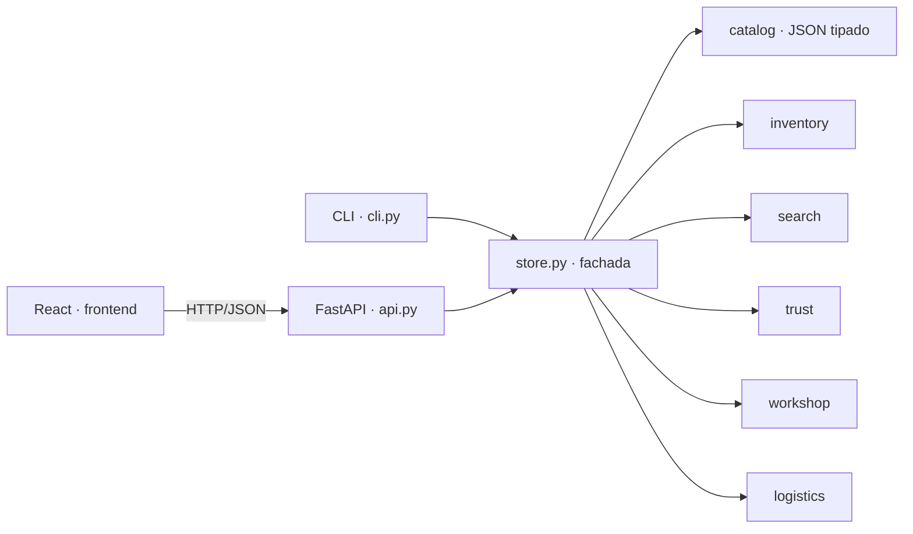

# Arquitectura

## Principio

Toda la inteligencia vive en **Python** (`backend/lenin_auto`); la interfaz React es un
cliente delgado que pide datos ya calculados: resultados con rangos resaltados, chips con
la consulta resultante al quitarlos, diagnósticos, planes, cotizaciones y certificados.

`Store` arma una sola vez catálogo, inventario, índices y modelos (~2 s) y expone cada caso
de uso como un método. La API y la CLI solo traducen.

## Datos

- `catalog/vehicles.json`: 13 fabricantes, 65 modelos, 125 generaciones, 118 motores.
- `catalog/taxonomy.json`: 13 categorías, 53 tipos de pieza con sinónimos regionales,
  4 niveles, 53 marcas, almacenes, formatos de números OEM.
- `catalog/lexicon.json`: alias de categorías y marcas, posiciones, niveles, combustibles.
- `catalog/symptoms.json`: 24 síntomas con frases coloquiales, pesos por pieza y vida útil.

Compatibilidad con una sola clave por producto: `g:<generación>` (carrocería/chasis),
`e:<motor>` (motor; sirve en todo modelo que lo monte: `G4FC` en Hyundai Accent y Kia Rio)
o `*` (universal). Un vehículo parcial o completo se traduce a un conjunto de claves.

## Búsqueda (`search/`)

1. **Intérprete** (`parser.py`): precio → número de parte/OEM (ventanas de hasta 4 palabras
   normalizadas) → **síntomas** → frases del léxico por coincidencia más larga → año,
   cilindrada y código de motor resueltos contra el modelo → corrección con
   Damerau-Levenshtein (sin confundir género: «encendida» ≠ «encendido»). Cada chip lleva
   la consulta que queda al quitarlo.
2. **Índice BM25F** (`bm25.py`, Robertson & Zaragoza): título 3, marca 2,5,
   especificaciones 1; k1 = 1,2, b = 0,75. Vocabulario ordenado para expandir prefijos
   por búsqueda binaria.
3. **Variantes por palabra** (`engine.py`): exacta 1,0 · prefijo 0,8 · **SymSpell** 0,7/0,5
   (`symspell.py`, borrado simétrico de Wolf Garbe) · **fonética española** 0,75
   (`phonetic.py`: b/v, s/c/z, ll/y, h muda, gu/w, g/j). Solo se corrige si no hay
   coincidencia exacta ni de prefijo, y se le avisa al cliente con el canal usado.
4. **Filtros y facetas disyuntivas**: una pasada con máscara de bits; si un producto falla
   en una sola dimensión, cuenta para esa faceta. También cuenta lo que oculta la
   compatibilidad.
5. **Ranking** (`fusion.py`): **Reciprocal Rank Fusion** (Cormack et al., SIGIR 2009) de
   relevancia textual (1,0), probabilidad de diagnóstico (1,2), compatibilidad (0,5),
   calidad bayesiana (0,35) y disponibilidad (0,2); luego **MMR** (Carbonell & Goldstein,
   SIGIR 1998) con λ = 0,5 para variar marcas y niveles en la primera página.

Mediana medida: 25–35 ms por consulta en CPython para 20 885 piezas (la API la mide al arrancar y la publica en `/api/stats`).

## Confianza (`trust/`)

| Módulo | Qué calcula |
| --- | --- |
| `ratings.py` | Promedio bayesiano `(n·R + m·C)/(n + m)` con C estimado del catálogo y m = 25; límite inferior de Wilson al 95 % |
| `value.py` | Índice de valor `R̃²·√garantía·stock/precio^0,7` (un «mejor valor» por grupo de equivalentes) y precio justo por percentil de su mercado |
| `brand.py` | Índice de confianza de marca 0–100 y nota A+…D (calificación escalada al rango real, garantía, disponibilidad, proveedor OEM, amplitud) |
| `fitment.py` | Estado y confianza de compatibilidad: confirmada, condicional (con probabilidad), universal, no |
| `certificate.py` | Token `base64url(carga).base64url(HMAC-SHA256)`, verificación con `hmac.compare_digest` |

## Taller (`workshop/`)

- **Diagnóstico**: `P(pieza | síntomas, km) ∝ P(pieza | km) · Π P(s | pieza)`, con
  ε = 0,03 para piezas que no explican un síntoma y a priori
  `0,25 + 0,75·F_Weibull(km; η = vida útil, β por categoría)`. Solo se consideran piezas que
  existen para ese vehículo.
- **Mantenimiento**: tareas con intervalo; en K km toca todo intervalo que divide a K.
  Tres paquetes por tarea (más barato con stock, mejor valor, mejor calificado de nivel
  alto). Con presupuesto, **mochila 0/1** por programación dinámica: paquetes indivisibles
  (aceite + filtro) y valor `(n+1)^prioridad`, que hace el óptimo lexicográfico: la
  seguridad siempre primero.

## Logística y VIN

- `logistics/shipping.py`: set cover exacto sobre los 2^W − 1 conjuntos de almacenes
  (menos envíos → menor plazo); reparto de líneas que no caben en uno solo.
- `vin.py`: WMI → fabricante, posición 10 → año (ciclo de 30), dígito verificador
  ISO 3779; opcionalmente modelo y cilindrada con la API vPIC de la NHTSA.

## Camino a producción

| Tema | Recomendación |
| --- | --- |
| Catálogo real | Reemplazar `inventory.py` por el feed del ERP, ACES/PIES o TecDoc manteniendo `Product`. |
| Escala | Con cientos de miles de piezas, mover el índice a Meilisearch/Typesense/OpenSearch; el intérprete, el diagnóstico y los algoritmos de confianza se reutilizan tal cual. |
| Persistencia | Pedidos y clientes en PostgreSQL; el garaje y el carrito ya son estado del cliente. |
| Secretos | `LENIN_SECRET` desde el gestor de secretos del proveedor; rotarlo invalida certificados viejos (se puede versionar con el campo `v`). |
| SEO | Prerenderizar fichas y categorías y pasar el enrutador por hash a rutas reales. |
