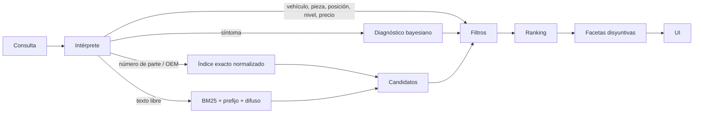

# Arquitectura

## Stack

| Capa     | Elección                                            | Por qué                                                             |
| -------- | --------------------------------------------------- | ------------------------------------------------------------------- |
| Interfaz | React 19 + TypeScript estricto                      | Ecosistema estándar, tipado de punta a punta.                       |
| Estilos  | Tailwind CSS 4 con tokens CSS (`src/index.css`)     | Tema claro/oscuro por variables, sin CSS muerto.                    |
| Build    | Vite 8 (`base: './'`)                               | Build de ~1 s; el resultado funciona en cualquier hosting estático. |
| Búsqueda | Motor propio sobre MiniSearch, en un **Web Worker** | El índice (~20 000 piezas) nunca bloquea la interfaz.               |
| Pruebas  | Vitest                                              | Pruebas del motor y los algoritmos.                                 |
| Fuentes  | Fontsource (autoalojadas)                           | Sin depender de Google Fonts; solo el subconjunto latino.           |

Sin backend: el catálogo de demostración se genera de forma determinista en el navegador.

## Carpetas

```
src/
  config.ts            nombre, moneda, idioma, umbral de envío gratis
  data/                vehículos, taxonomía, marcas, almacenes, inventario (generador)
  search/              texto, intérprete, diagnóstico, motor, worker y cliente
  lib/                 enrutador, estado, VIN, índice de valor, envíos, mantenimiento
  state/app.ts         garaje, carrito, recientes, tema, avisos
  components/          encabezado, paleta de búsqueda, lámina del vehículo, tarjetas…
  pages/               inicio, resultados, ficha, catálogo, mantenimiento
```

## Modelo de compatibilidad

Cada producto tiene una sola clave `fit`:

- `g:<generación>` — piezas de carrocería/chasis (pastillas, amortiguadores, faros).
- `e:<código de motor>` — piezas de motor (filtros, bujías, distribución). Un mismo motor
  aparece en varios modelos y marcas (p. ej. `G4FC` en Hyundai Accent y Kia Rio, `Duratorq 3.2`
  en Ford Ranger y Mazda BT-50), así que la compatibilidad cruzada sale sola.
- `*` — universales (aceites, líquidos, bombillos).

Un vehículo (completo o parcial) se traduce a un conjunto de claves con `fitKeysFor()`, y
filtrar es una búsqueda en un `Set`: O(1) por producto.

## Flujo de una búsqueda



1. **Intérprete** (`search/parser.ts`)
   - Rangos de precio: «menos de 60», «entre 20 y 80», «desde 100».
   - Número de parte: la consulta completa o ventanas de hasta 4 palabras se normalizan
     (`P 83 140` = `p83-140` = `P83140`) y se buscan en un mapa exacto de parte, OEM y
     referencias cruzadas.
   - Síntomas (ver abajo), antes que las frases de piezas para que «luz de motor» no se lea como
     las categorías Iluminación y Motor.
   - Diccionario de frases con coincidencia más larga primero: modelos (con alias: `cr-v`,
     `crv`, `cr v`), marcas, tipos de pieza con sinónimos regionales (balatas, mofle, croche,
     rótula, maza, bocín…), categorías, marcas de repuesto, posición, nivel, combustible.
   - Año, cilindrada («2.8») y código de motor («2zr-fe», «1gd»), resueltos contra el modelo.
   - Corrección de errores con distancia de Damerau-Levenshtein (1 error hasta 7 letras, 2
     desde 8), sin confundir género («encendida» no es «encendido»).
   - Singular/plural con una regla simple y predecible (la misma al indexar y al buscar).
2. **Texto libre**: MiniSearch (BM25) con pesos por campo (título 3, marca 2,5, specs 1),
   prefijo en la última palabra, difuso desde 5 letras. Si con AND no hay nada, prueba con la
   corrección ortográfica del vocabulario y luego con OR (y lo avisa).
3. **Filtros y facetas disyuntivas**: cada producto se evalúa una vez con una máscara de bits
   por dimensión. Si falla en una sola dimensión cuenta para esa faceta; así cada faceta muestra
   cuántos resultados tendrías al marcar otra opción (como Algolia). También cuenta las piezas
   ocultas por compatibilidad.
4. **Ranking**: `10·texto + 8·P(causa) + 0,8·compatible + 0,25·log(popularidad) + 0,4·stock`.

Rendimiento medido (Node 22, 20 885 piezas): índice en ~550 ms dentro del worker, mediana de
consulta ~4 ms. La portada muestra la mediana real medida en el navegador del visitante.

## Algoritmos exclusivos

### Diagnóstico por síntomas — `search/diagnosis.ts`

`P(pieza | síntoma, vehículo) ∝ P(síntoma | pieza) · (0,35 + 0,65 · (1 − e^(−km / vida útil)))`

- 24 síntomas con frases coloquiales («chilla al frenar», «jalonea», «bota agua»).
- `km` se estima por la antigüedad del vehículo (15 000 km/año) o se toma del usuario.
- Se descartan causas sin piezas para ese vehículo (un Corolla 2016 no tiene zapatas) y se
  renormaliza.

### Plan de mantenimiento — `lib/service.ts`

Tareas con intervalo (aceite 10 000 km, bujías 40 000, distribución 100 000…). En el servicio
de K km toca todo lo que divide a K. Por tarea se arman tres paquetes: el más barato con
existencias, el de mejor índice de valor y el mejor calificado de nivel alto. Cantidades según el
motor (bujías × cilindros); aceite según combustible y año (15W-40 diésel, 0W-20 desde 2018).

### Índice de valor — `lib/value.ts`

`(valoración/5)² · confianza(reseñas) · √(años de garantía) · stock / precio^0,7`, comparado solo
entre opciones de la misma pieza. El exponente < 1 evita que siempre gane lo más barato.

### Consolidación de envíos — `lib/shipping.ts`

Búsqueda exacta sobre los 2^W − 1 conjuntos de almacenes (7 con 3 almacenes): menos envíos,
luego menor plazo máximo. Lo que no alcanza con el stock total va a pedido.

### Decodificador de VIN — `lib/vin.ts`

Fabricante por WMI, año por la posición 10, dígito verificador ISO 3779, región de origen; y si
hay red, modelo y cilindrada con la API pública vPIC de la NHTSA.

## Camino a producción

| Tema              | Recomendación                                                                                                                                                                                                                 |
| ----------------- | ----------------------------------------------------------------------------------------------------------------------------------------------------------------------------------------------------------------------------- |
| Datos de catálogo | Reemplazar `data/inventory.ts` por el feed real: ERP propio, estándares ACES/PIES o TecDoc para compatibilidad y referencias cruzadas.                                                                                        |
| Búsqueda a escala | Con cientos de miles de piezas, mover el índice a Meilisearch o Typesense (tienen sinónimos, tolerancia a errores y facetas). El intérprete, el diagnóstico y los algoritmos de `lib/` se reutilizan tal cual en el servidor. |
| Comercio          | Carrito y pedidos en un backend headless (Medusa, Shopify Storefront API o WooCommerce).                                                                                                                                      |
| Pagos             | Mercado Pago, Stripe o la pasarela local.                                                                                                                                                                                     |
| SEO               | Prerenderizar fichas y categorías (Vite SSG o migrar las páginas a Astro/Next.js) y cambiar el enrutador por hash a rutas reales; la ficha ya publica datos estructurados `Product` (JSON-LD).                                |
| Analítica         | Registrar búsquedas sin resultados para ampliar sinónimos y síntomas.                                                                                                                                                         |
