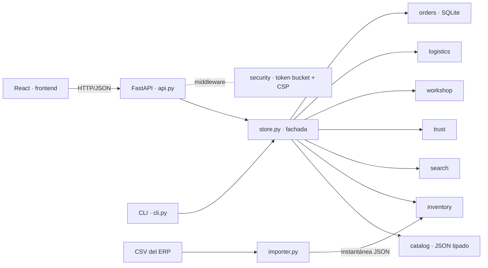

# Arquitectura

## Principio

Toda la inteligencia vive en **Python** (`backend/lenin_auto`); la interfaz React es un
cliente delgado que pide datos ya calculados: resultados con rangos resaltados, chips con
la consulta resultante al quitarlos, diagnósticos, planes, cotizaciones y certificados.

`Store` arma una sola vez catálogo, inventario, índices y modelos (~2 s) y expone cada caso
de uso como un método. La API y la CLI solo traducen.

## Datos

- `catalog/vehicles.json`: 13 fabricantes, 65 modelos, 125 generaciones, 118 motores.
- `catalog/taxonomy.json`: 13 categorías, 53 tipos de pieza con sinónimos regionales,
  4 niveles, 53 marcas, almacenes, formatos de números OEM.
- `catalog/lexicon.json`: alias de categorías y marcas, posiciones, niveles, combustibles.
- `catalog/symptoms.json`: 24 síntomas con frases coloquiales, pesos por pieza y vida útil.

### Compatibilidad exacta

Cada producto lleva un **conjunto** de claves, siempre en la forma más compacta de lo que
declara el fabricante:

| Clave | Significa |
| --- | --- |
| `*` | universal |
| `e:<motor>` | todo vehículo que monte ese motor (`G4FC` en Hyundai Accent y Kia Rio) |
| `g:<generación>` | toda la generación, cualquier motor |
| `ge:<generación>:<motor>` | la generación, solo con ese motor |
| `y:<generación>:<año>` | un año de la generación, cualquier motor |
| `ye:<generación>:<año>:<motor>` | un año y un motor |

Una configuración exacta (generación, año, motor) cubre sus cinco claves; un vehículo
parcial se expande a la unión de las de todas las configuraciones que admite (memorizado).
Una pieza sirve si comparte al menos una clave. `fitment.py` evalúa la pieza contra
**cada** configuración del vehículo: *confirmada* si sirve en todas, *condicional* con la
proporción que cubre y la razón exacta de lo que falta saber («Sirve en tu modelo en
2014–2016: indica el año»). Así nunca se certifica un año o un motor que el fabricante no
declaró.

## Búsqueda (`search/`)

1. **Intérprete** (`parser.py`): precio → número de parte/OEM (ventanas de hasta 4 palabras
   normalizadas) → **síntomas** → frases del léxico por coincidencia más larga → año,
   cilindrada y código de motor resueltos contra el modelo → corrección con
   Damerau-Levenshtein (sin confundir género: «encendida» ≠ «encendido»). Cada chip lleva
   la consulta que queda al quitarlo.
2. **Índice BM25F** (`bm25.py`, Robertson & Zaragoza): título 3, marca 2,5,
   especificaciones 1; k1 = 1,2, b = 0,75. Vocabulario ordenado para expandir prefijos
   por búsqueda binaria.
3. **Variantes por palabra** (`engine.py`): exacta 1,0 · prefijo 0,8 · **SymSpell** 0,7/0,5
   (`symspell.py`, borrado simétrico de Wolf Garbe) · **fonética española** 0,75
   (`phonetic.py`: b/v, s/c/z, ll/y, h muda, gu/w, g/j). Solo se corrige si no hay
   coincidencia exacta ni de prefijo, y se le avisa al cliente con el canal usado.
4. **Filtros y facetas disyuntivas por álgebra de conjuntos**: cada valor de faceta, cada
   clave de compatibilidad, «en stock» y «en oferta» es un entero de Python con un bit por
   producto (≈2,6 KB). Un filtro es un AND; la faceta de una dimensión cuenta
   `popcount(candidatos ∧ todos los demás filtros ∧ valor)`, así que muestra cuánto verías
   al marcar esa opción. Lo que oculta la compatibilidad es `candidatos ∧ ¬compatibles ∧
   filtros`. Todo corre en C; no hay bucle de Python por producto.
5. **Ranking** (`fusion.py`): **Reciprocal Rank Fusion** (Cormack et al., SIGIR 2009) de
   relevancia textual (1,0), probabilidad de diagnóstico (1,2), compatibilidad (0,5),
   calidad bayesiana (0,35) y disponibilidad (0,2); luego **MMR** (Carbonell & Goldstein,
   SIGIR 1998) con λ = 0,5 para variar marcas y niveles en la primera página. Las claves
   de orden son listas precalculadas (`__getitem__` en C), RRF suma lista por lista con
   diccionarios, MMR mantiene la similitud máxima de forma incremental (O(n·k) en vez de
   O(n·k²)), y solo se materializa la página pedida.
6. **Histograma de precios**: la cubeta es monótona en el precio, así que se ordenan los
   precios y se busca cada corte por bisección.

Rendimiento en CPython con 20 885 piezas: mediana de **2,6 ms** por consulta, p90 de 5 ms
y 24 ms en el peor caso (las 20 885 piezas ordenadas); antes de los conjuntos de bits,
25 ms de mediana y 100 ms en el peor caso. Las pruebas diferenciales
(`tests/test_engine_equivalence.py`) comparan cada estructura rápida contra la definición
literal: conteos, facetas, RRF e histograma iguales bit a bit.

## Confianza (`trust/`)

| Módulo | Qué calcula |
| --- | --- |
| `ratings.py` | Promedio bayesiano `(n·R + m·C)/(n + m)` con C estimado del catálogo y m = 25; límite inferior de Wilson al 95 % |
| `value.py` | Índice de valor `R̃²·√garantía·stock/precio^0,7` (un «mejor valor» por grupo de equivalentes) y precio justo por percentil de su mercado |
| `brand.py` | Índice de confianza de marca 0–100 y nota A+…D (calificación escalada al rango real, garantía, disponibilidad, proveedor OEM, amplitud) |
| `fitment.py` | Estado y confianza de compatibilidad: confirmada, condicional (con probabilidad), universal, no |
| `certificate.py` | Token `base64url(carga).base64url(HMAC-SHA256)`, verificación con `hmac.compare_digest` |

## Taller (`workshop/`)

- **Diagnóstico**: `P(pieza | síntomas, km) ∝ P(pieza | km) · Π P(s | pieza)`, con
  ε = 0,03 para piezas que no explican un síntoma y a priori
  `0,25 + 0,75·F_Weibull(km; η = vida útil, β por categoría)`. Solo se consideran piezas que
  existen para ese vehículo.
- **Mantenimiento**: tareas con intervalo; en K km toca todo intervalo que divide a K.
  Tres paquetes por tarea (más barato con stock, mejor valor, mejor calificado de nivel
  alto). Con presupuesto, **mochila 0/1** por programación dinámica: paquetes indivisibles
  (aceite + filtro) y valor `(n+1)^prioridad`, que hace el óptimo lexicográfico: la
  seguridad siempre primero.

## Tu inventario (`importer.py`)

La planilla del ERP o del proveedor, tal como viene:

- **Formato**: separador por consistencia de columnas (`,` `;` tab `|`), BOM de Excel,
  UTF-8 o Windows-1252; precios `$1.234,50`, `1,234.50`, `45,9`. Si un número es ambiguo
  (`1.234`), lo dice.
- **Encabezados** en español o inglés, sin tildes, con «Nº de», abreviados o con un error:
  «SKU», «Precio venta», «Existencias Norte» (existencias por almacén), «Aplicación».
- **Marca** por nombre, alias o Damerau-Levenshtein; en nombres cortos solo se aceptan dos
  letras vecinas intercambiadas («NKG» → NGK). Una marca desconocida se da de alta y hereda
  niveles y categorías de lo importado.
- **Tipo de pieza, posición y nivel** con el intérprete del buscador. Una corrección de
  tipeo solo cuenta si el texto no nombra ya una pieza: «Discos de freno ventilados» no es
  un electroventilador.
- **Aplicación**: `Toyota Corolla 2014-2016; Yaris 1.5 2012+; Hilux diésel hasta 2015; Jeep
  Wrangler JK; Motor 2ZR-FE`. Se reconocen códigos de motor (el más largo primero), tramos
  de años (`2014-19`, `14-19`, `2016+`, `desde`, `hasta`, `antes de`), cilindrada, cc,
  combustible y el código de generación. El resultado se traduce a la clave más compacta
  exacta. Si un año tuvo dos generaciones, se avisa.
- **Reporte**: cada fila produce una pieza o un error con su causa; las decisiones tomadas
  (una marca corregida, un motor supuesto) quedan como avisos. Se exporta a CSV.
- **Ida y vuelta**: `exportar` escribe el mismo formato; exportar e importar las 20 885
  piezas devuelve el inventario idéntico (lo verifica una prueba).

El resultado es una instantánea JSON (`LENIN_INVENTORY`); la tienda la carga en lugar de la
demostración y el aviso de «catálogo de demostración» desaparece de la interfaz.

## Pedidos (`orders.py`)

- Código `LAC-7Q2M-9XKD-4`: 40 bits de `secrets` en base32 de Crockford (sin I, L, O, U) +
  carácter verificador **Luhn mod 32**. Detecta todo carácter mal escrito y toda
  transposición de vecinos salvo la teórica 0↔Z; al leerlo se aceptan minúsculas, espacios
  y O/I/L por 0/1/1.
- SQLite en modo WAL, conexión por operación, máquina de estados con historial
  (recibido → preparando → enviado → entregado; cancelado desde los dos primeros).
- `Idempotency-Key` evita pedidos dobles; la consulta exige código **y** correo, con
  comparación de tiempo constante y la misma respuesta si falta cualquiera.
- Precios congelados, un certificado firmado por cada pieza compatible confirmada y fecha
  estimada en días hábiles.

## Protección (`security.py`)

- **Token bucket** por cliente (ráfaga `LENIN_RATE_BURST`, ritmo `LENIN_RATE_PER_SECOND`),
  O(1) por petición y memoria acotada (LRU); cabeceras `RateLimit-*` y `Retry-After`.
- CSP estricta (solo recursos propios; las fuentes van incluidas en la interfaz), `nosniff`,
  `X-Frame-Options: DENY`, `Referrer-Policy`, `Permissions-Policy`, COOP y HSTS sobre HTTPS.

## Logística y VIN

- `logistics/shipping.py`: set cover exacto sobre los 2^W − 1 conjuntos de almacenes
  (menos envíos → menor plazo); reparto de líneas que no caben en uno solo.
- `vin.py`: WMI → fabricante, posición 10 → año (ciclo de 30), dígito verificador
  ISO 3779; opcionalmente modelo y cilindrada con la API vPIC de la NHTSA.

## Camino a producción

| Tema | Recomendación |
| --- | --- |
| Catálogo real | `importar` desde el CSV del ERP (listo); un conector ACES/PIES o TecDoc produciría la misma instantánea. |
| Escala | Con cientos de miles de piezas, mover el índice a Meilisearch/Typesense/OpenSearch; el intérprete, el diagnóstico y los algoritmos de confianza se reutilizan tal cual. |
| Persistencia | Pedidos en SQLite (WAL) con volumen en Docker; con varias réplicas, PostgreSQL detrás de la misma interfaz `OrderBook`. |
| Secretos | `LENIN_SECRET` desde el gestor de secretos del proveedor; rotarlo invalida certificados viejos (se puede versionar con el campo `v`). |
| SEO | Prerenderizar fichas y categorías y pasar el enrutador por hash a rutas reales. |
